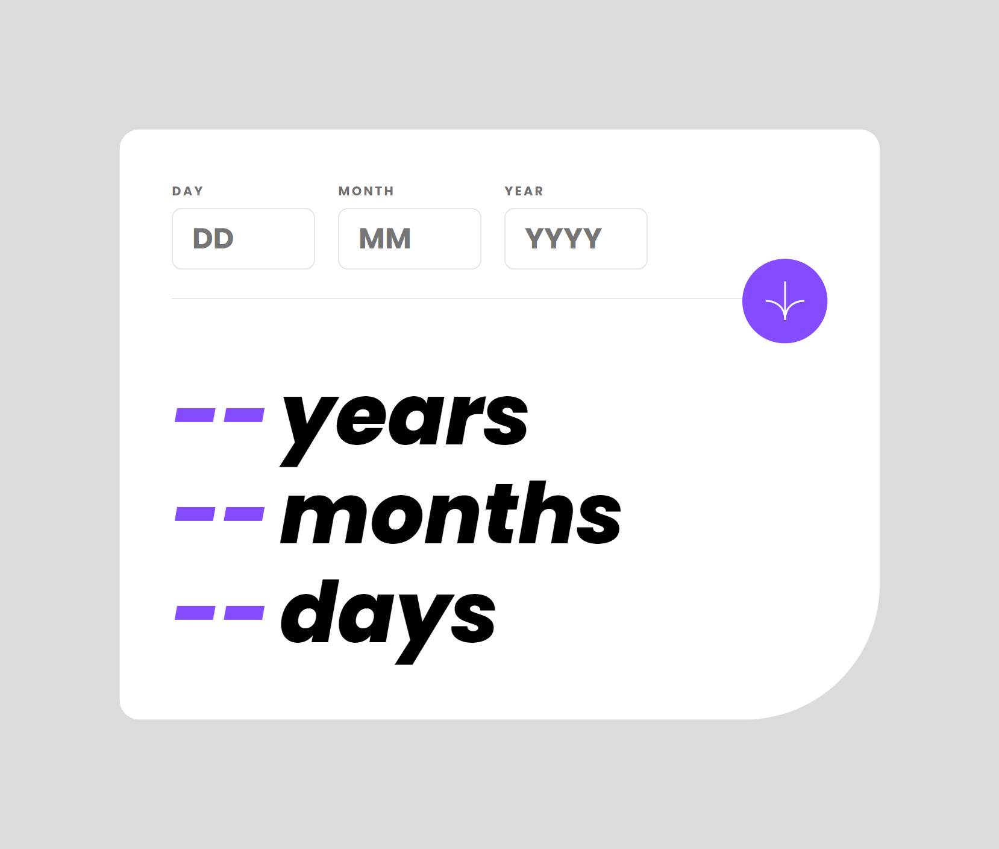

# Frontend Mentor - Age calculator app solution

This is a solution to the [Age calculator app challenge on Frontend Mentor](https://www.frontendmentor.io/challenges/age-calculator-app-dF9DFFpj-Q). Frontend Mentor challenges help you improve your coding skills by building realistic projects. 

## Table of contents

- [Frontend Mentor - Age calculator app solution](#frontend-mentor---age-calculator-app-solution)
  - [Table of contents](#table-of-contents)
  - [Overview](#overview)
    - [The challenge](#the-challenge)
    - [Screenshot](#screenshot)
    - [Links](#links)
  - [My process](#my-process)
    - [Built with](#built-with)
    - [What I learned](#what-i-learned)
    - [Useful resources](#useful-resources)
  - [Author](#author)

**Note: Delete this note and update the table of contents based on what sections you keep.**

## Overview

### The challenge

Users should be able to:

- View an age in years, months, and days after submitting a valid date through the form
- Receive validation errors if:
  - Any field is empty when the form is submitted
  - The day number is not between 1-31
  - The month number is not between 1-12
  - The year is in the future
  - The date is invalid e.g. 31/04/1991 (there are 30 days in April)
- View the optimal layout for the interface depending on their device's screen size
- See hover and focus states for all interactive elements on the page
- **Bonus**: See the age numbers animate to their final number when the form is submitted

### Screenshot

### Links

- Solution URL: [Github](https://github.com/mostafa-meerzad/age-calculator)
- Live Site URL: [Netlify](https://shimmering-pastelito-6cb8bd.netlify.app/)

## My process

### Built with

- Semantic HTML5 markup
- CSS custom properties
- Flexbox
- CSS Grid
- Mobile-first workflow
- [React](https://reactjs.org/) - JS library
- [GSAP](https://greensock.com/) - JS library for animations

### What I learned

Using gsap to animat property-values of an object 

### Useful resources

- [gsap docs](https://greensock.com/get-started/) - This is an AWESOME resource to start learning gsap and get a general idea of how powerfull gsap is. 

## Author

- Frontend Mentor - [@mostafa-meerzad](https://www.frontendmentor.io/profile/mostafa-meerzad)
- Github - [mostafa-meerzad](https://github.com/mostafa-meerzad)
- Instagram - [mostafa-meerzad](https://www.instagram.com/mostafameerzad/)
- linkedIn - [mostafa-meerzad-a753371b7](https://www.linkedin.com/in/mostafa-meerzad-a753371b7)

